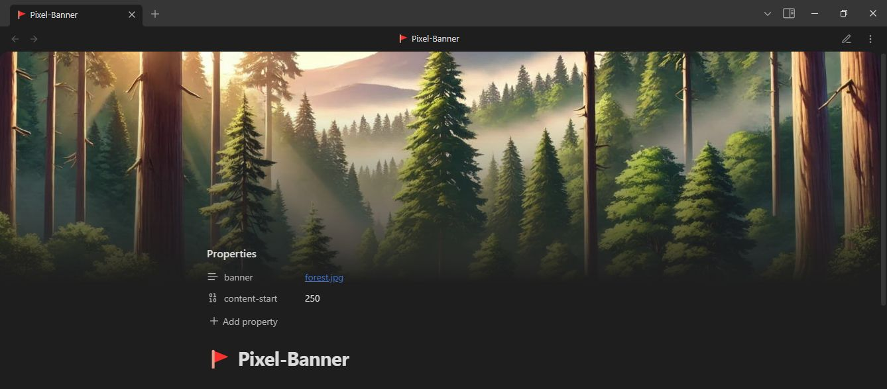
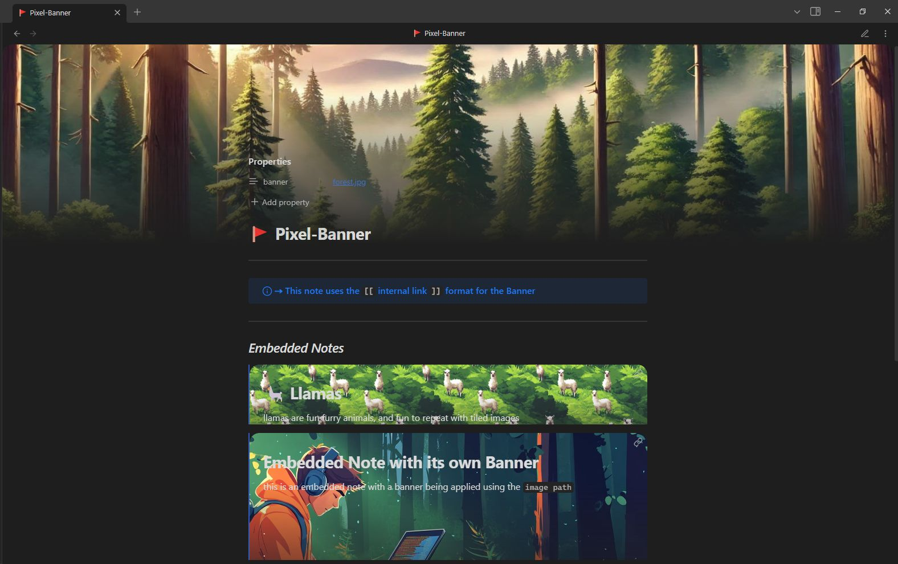
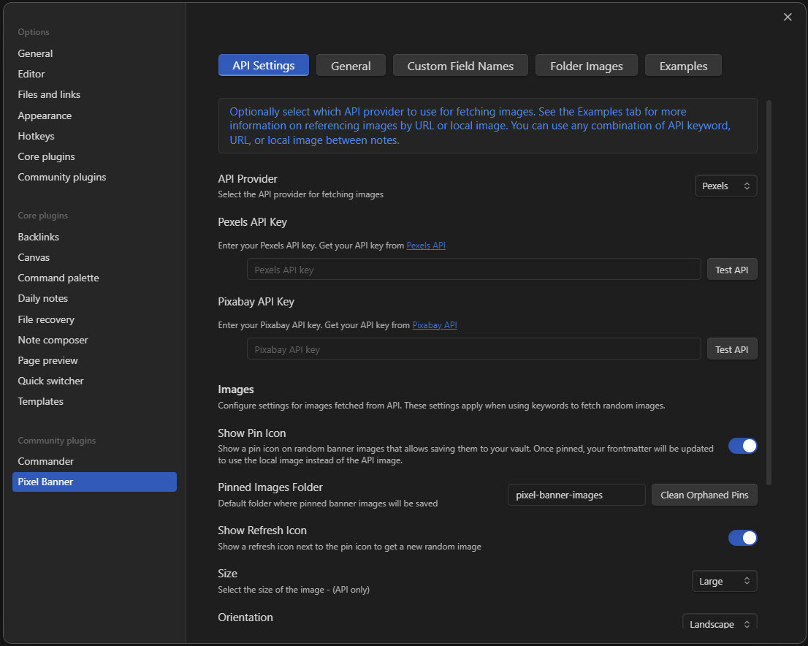
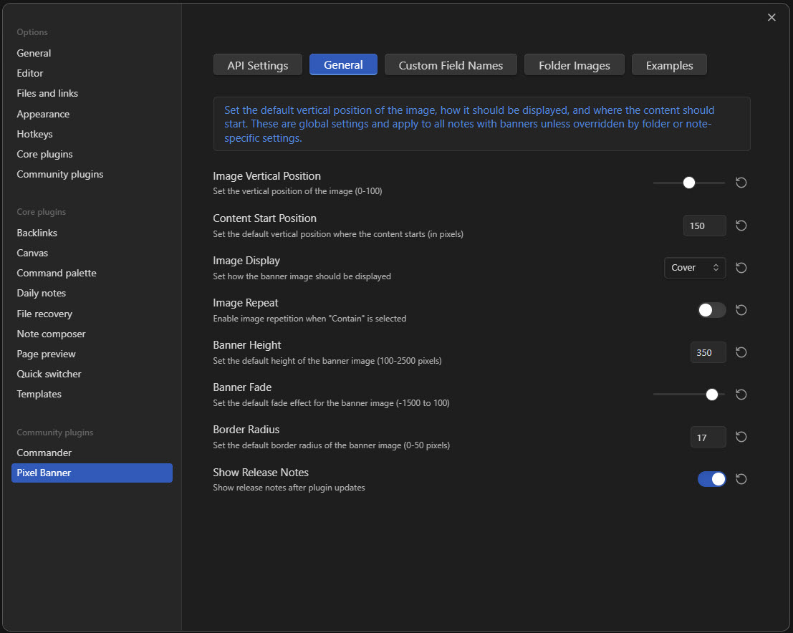
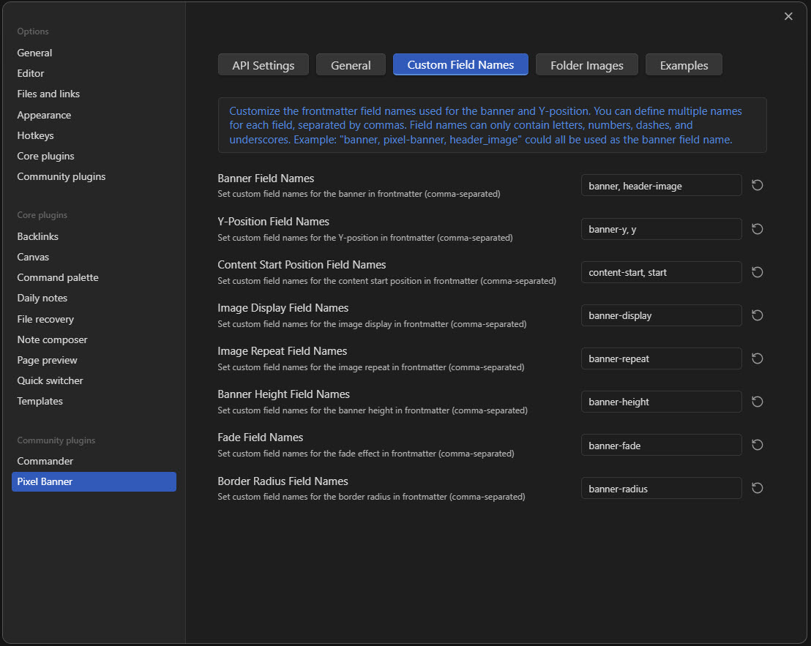
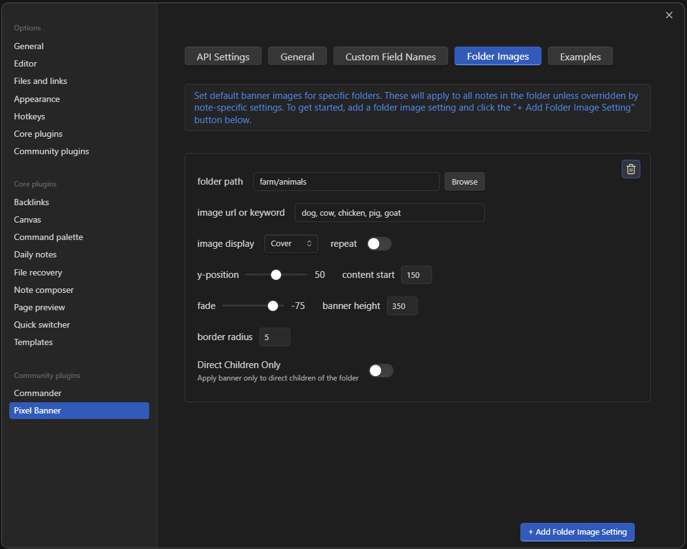
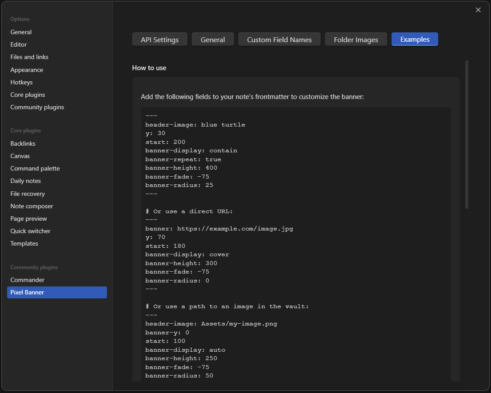

# 🚩 Pixel Banner for Obsidian

Pixel Banner is a plugin for Obsidian that allows you to automatically add beautiful banner images to your notes using the Pexels/Pixabay APIs, direct URLs, or folder-specific settings. Enhance your note-taking experience with visually appealing headers that provide context and improve the overall aesthetics of your notes.



## Features

- Automatically fetch and display banner images from Pexels/Pixabay based on keywords
- Use direct URLs for custom images
- Use local images from your vault
- Use Obsidian internal links to images
- Set folder-specific default banner images
- Customize image size and orientation
- Set default keywords for when no specific keyword is provided
- Adjust vertical position of the banner image globally, per folder, or per note
- Customize banner height (100-2500 pixels)
- Control fade transparency (-1500 to 100)
- Customize frontmatter field names
- Set a custom start position for the content below the banner image
- Set the banner image display to cover or contain and adjust wrapping
- Seamless integration with Obsidian's interface

## Installation

1. Open Obsidian and go to Settings
2. Navigate to Community Plugins and disable Safe Mode
3. Click on Browse and search for "Pexels Banner" or "Pixel Banner"
4. Install the plugin and enable it

### Manual Installation
- Unzip the [latest release](https://github.com/jparkerweb/pixel-banner/releases/latest) into your `<vault>/.obsidian/plugins/` folder.

## Usage

1. Obtain a free API key from [Pexels](https://www.pexels.com/api/) or [Pixabay](https://pixabay.com/api/docs/)
2. In Obsidian, go to Settings > Pixel Banner and enter your API key(s)
3. In any note, add a `banner` field to the frontmatter with keywords for the desired image, a direct URL, a path to a local image, or an Obsidian internal link:

```yaml
---
banner: blue turtle
---

### Or use a direct URL:

---
banner: https://example.com/image.jpg
---

### Or use a local image:

---
banner: /path/to/local/image.jpg
---

### Or use an Obsidian internal link:

---
banner: [[path/to/internal/image.jpg]]
---

### All settings can be overridden per note:

---
banner: ocean
banner-y: 30
content-start: 90
banner-display: contain
banner-repeat: true
banner-height: 500
banner-fade: -75
banner-radius: 50
---
```

### Folder-Specific Banners

You can set default banner images for entire folders:

1. Go to Settings > Pixel Banner
2. Scroll down to the "Folder Images" section
3. Click "Add Folder Image"
4. Configure the folder settings:
   - Folder path
   - Image URL or keyword
   - Y-position (0-100)
   - Banner height (100-2500 pixels)
   - Fade effect (-1500 to 100)
   - Display mode and repeat settings
   - Direct Children Only: Enable this option to apply the banner settings only to the direct children of the specified folder, excluding subfolders.
5. Repeat for additional folders as needed

Folder-specific settings will apply to all notes in that folder (and subfolders) that don't have their own banner specified in the frontmatter, unless the "Direct Children Only" option is enabled.

## Configuration

In the plugin settings, you can customize:

- API Provider (Pexels or Pixabay)
  - Test your API keys directly in settings with the "Test API" button
  - Get immediate feedback if your API key is valid
- Image size (small, medium, large)
- Image orientation (landscape, portrait, square)
- Number of images to fetch (1-50)
- Default keywords for when no specific keyword is provided
- Global y-position of the banner image (0-100)
- Global banner height (100-2500 pixels, default 350)
- Global fade effect (-1500 to 100, default -75)
- Custom field names for all settings
- Folder-specific default banner images
- Global border radius (0-100 pixels, default 17)

All global settings can be overridden on a per-folder or per-note basis.

### Custom Field Names

You can customize the frontmatter field names used for each setting, and even define multiple names for each field. For example, if you set the banner field names to "banner, header-image, cover" and 
the Y-position field names to "banner-y, y-pos", you could use any 
of these variations in your frontmatter:

```yaml
---
header-image: sunset
y-pos: 22
---

---
banner-y: 60
y-pos: 60
---

---
header-image: sunset
banner-y: 30
---
```

Field names must follow these rules:
- Only letters, numbers, dashes, and underscores are allowed
- No spaces within field names (spaces after commas are fine)
- Names must be unique across all fields

## Example Note Screenshot



## Settings Screenshot











## Appreciation
If you enjoy this plugin please consider sending me a tip to support my work 😀
### [🍵 tip me here](https://ko-fi.com/jparkerweb)

## Feedback and Support

If you encounter any issues or have suggestions for improvements, please [open an issue](https://github.com/jparkerweb/pixel-banner/issues) on the GitHub repository.

## Credits

This plugin optionally uses the [Pexels](https://www.pexels.com/api/) and [Pixabay](https://pixabay.com/api/docs/) APIs to fetch images. Special thanks to Pexels / Pixabay for providing this service.
